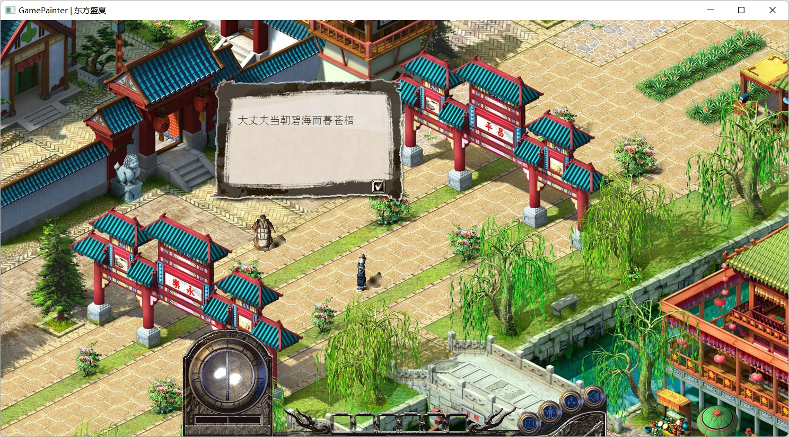
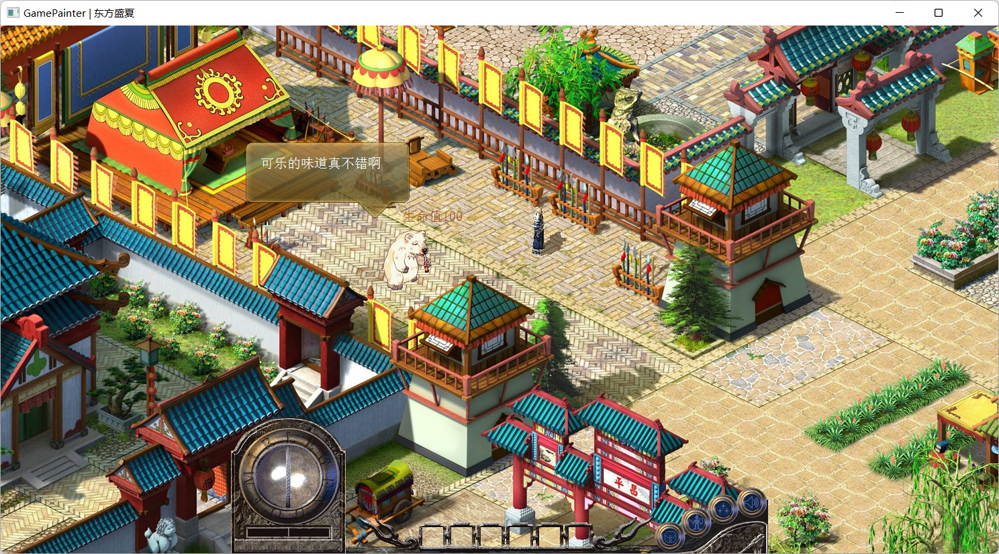

## 简介

这是一个基于 windows 平台的 2D 游戏/应用框架，由 C++ 编写的引擎层和 lua 编写的应用层构成。

引擎的编写应用了较多现代 C++ 特性，如使用各种 STL 容器、智能指针和 std::promise 等重建 windows 窗口编程模型，让窗口的创建和管理方式得以简化。在引擎中嵌入 Lua 解释器时，为了让 C++ 调用 Lua 函数的形式能够像引用原生函数一样简洁，使用变参模板、类型转发和函数重载等技巧，将 C/Lua 交互方式从原来的多行代码缩减为一行，封装的模板函数还支持直接传递字典和列表等高级数据结构。引擎的图形图像部分，充分应用了 windows GDI+ 的功能特性，绘图效率较高，且使用了双缓冲绘图技术，保证动画效果稳定、不闪屏。此外，整个 C++ 项目使用 gn/ninja 工具组织构建，编译速度快，且便于维护和扩展。

基于 C++ 引擎，用 Lua 编写了一个 2D RPG 游戏 Demo（使用了梦幻西游和传奇的游戏素材），这里应用了较多面向对象设计，使得场景中各个游戏元素能最大程度复用共性代码，程序结构和游戏世界实现了近似同构。

## 编译构建

有下列两种可选的编译构建方式，构建完成后，将`GamePainter.exe`移动到`usage`目录下运行，可以看到演示游戏画面，鼠标右键控制人物移动，左键点击 NPC 会弹出对话框。

### 使用 gn + ninja 构建

前置条件：

- windows 环境
- MSVC 构建工具及 windows SDK

gn 与 ninja 工具已经预置在 build 目录下，可直接执行以下命令：

```shell
build/gn gen -C out
build/ninja -C out
```

### 手动编译

前置条件：

- windows 环境
- clang/LLVM 工具集
- MSVC 构建工具及 windows SDK

执行以下命令：

```shell
cd noumenon
clang++ main.cpp ui/win.cpp lua/lua_machine.cpp utils/*.cpp -o GamePainter.exe -Iui -Ilua -Iutils -Llua/bin -llua_static -luser32 -lgdi32 -lgdiplus -lwinmm -lImm32
```

如果您需要使用其他基于 MSVC 构建的三方库，请改用 `clang-cl` 编译，并添加恰当的 `/MT` 或 `/MD` 选项，可避免 MSVC 运行时库相关冲突（如出现未解析符号告警）。

## 效果图






